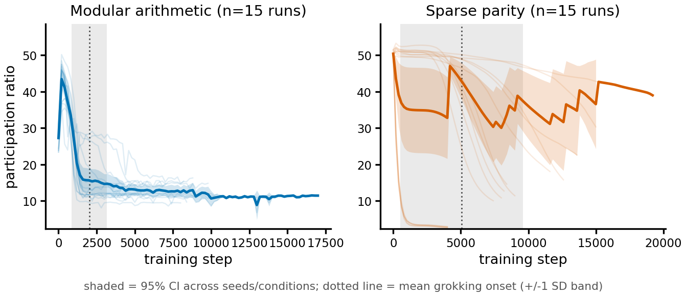
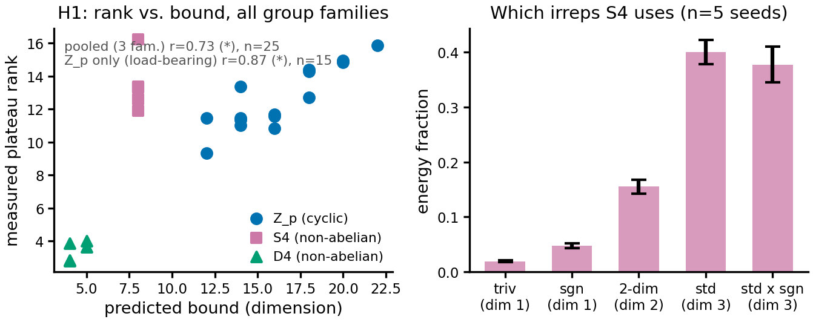

<h1 align="center">The Isotypic Bottleneck</h1>
<p align="center">
  <b>A Representation-Theoretic Bound on Rank Collapse During Grokking,<br/>and Its Limits as a Precursor Signal</b>
</p>

<p align="center">
  <a href="paper/main.tex">Paper (LaTeX source)</a> ·
  <a href="notebooks/isotypic_bottleneck.ipynb">Reproducibility notebook</a> ·
  <a href="results/">Results</a> ·
  <a href="#citation">Citation</a>
</p>

<p align="center">
  
  
  
  
</p>

---

> **Note on timing.** This repository accompanies a paper currently under review at **NeurReps 2026** (Symmetry and Geometry in Neural Representations, a NeurIPS workshop). NeurReps review is double-blind. If you're the author reading this before decisions are out: consider whether making this repository public now is consistent with your venue's anonymity policy — it names you.

## What this is

Effective-rank collapse — the sharp drop in a network's internal representation dimensionality right before it generalizes — has been proposed as a cheap, architecture-agnostic early-warning signal for **grokking**. It works cleanly on modular arithmetic. It does not work on sparse parity, and nobody had explained why.

This project gives a **representation-theoretic account** of that asymmetry:

- **A proven lemma**: if a network's internal representation of a group decomposes into isotypic components, its rank is bounded by the summed dimension of whichever components are occupied. For cyclic groups (ℤ<sub>p</sub>), every non-trivial irrep is 2-dimensional, so the bound collapses to "twice the number of active Fourier frequencies" — recovering the modular-arithmetic story as a special case. For sparse parity, the relevant symmetry group's irreps (Walsh characters) are all 1-dimensional and combinatorially numerous, so no analogous small subspace exists to collapse into.
- **Empirical confirmation on cyclic groups**, replicated across three independent full runs, extended honestly to a non-abelian group (the dihedral group D₄) with an explicit account of which part of the pooled evidence is actually load-bearing.
- **A tested, and failed, natural fix** for parity: a representation-theoretic alignment score doesn't restore a usable precursor either — reported as a negative result, not hidden.
- **An unrelated, independently-motivated finding reported alongside it**: a weight-decay-driven timing bound that holds as a genuine lower bound on generalization time in 25 of 30 runs, with the five exceptions being *exactly* the five runs that independently fail a delayed-generalization diagnostic.
- **A controlled disentangling experiment** on why the symmetric group S₄ never converges at all — reported as genuinely mixed, not forced into a clean story.

The paper's own stance, stated in its closing line, is the one this repository tries to live up to:

> *We report all of this, including the negative results, because we believe an honest account of what a representation-theoretic bound does and does not predict is more useful than a narrower story that only reports the parts that worked.*

## Results

All numbers below are pulled directly from [`results/tables/`](results/tables/) and [`results/metrics/`](results/metrics/) — not retyped from the paper, generated by the same run that produced it.

**H1 — rank tracks the isotypic bound** ([`h1_pooled_honesty_check.csv`](results/tables/h1_pooled_honesty_check.csv))

| Comparison | *r* | *p* | *n* |
|---|---|---|---|
| ℤ<sub>p</sub> only (load-bearing) | 0.87 | 3.0 × 10⁻⁵ | 15 |
| Pooled excluding S4 (ℤ<sub>p</sub> + D₄) | **0.97** | 4.3 × 10⁻¹³ | 20 |
| Pooled (ℤ<sub>p</sub> + S4 + D₄) | 0.73 | 4.0 × 10⁻⁵ | 25 |
| D₄ only | 0.63 | 0.25 | 5 |
| S4 only | — | — | undefined (zero within-family variance) |

**H2 — the natural fix for parity does not work** ([`h2_lead_time_significance_compact.csv`](results/tables/h2_lead_time_significance_compact.csv)): across all 7 signal/task comparisons tested, only one nominally crosses the Bonferroni threshold (parity weight-norm, *p* = 0.005) — and it disagrees with its own sign-test cross-check (*p* = 0.151), and it's the mechanism prior work already established, not this paper's contribution. The primary comparison (Walsh alignment score, degree ≤ 1) is not significant (*p* = 0.744).

**The weight-decay clock** ([`weight_decay_clock.csv`](results/tables/weight_decay_clock.csv)): holds as a lower bound in 25/30 runs; the 5 exceptions are exactly the 5 *k*=2 sparse-parity runs, which independently turn out to solve the task immediately rather than exhibit a genuine delayed-generalization transition ([`ablation_k_sweep.csv`](results/tables/ablation_k_sweep.csv)).

**Disentangling S4 vs. D₄** ([`nonabelian_wd_grid_summary.csv`](results/tables/nonabelian_wd_grid_summary.csv)): neither group reaches the grokking threshold at any tested weight decay, but D₄ shows substantial partial generalization (11–46%, mean 28.5%, vs. 12.5% chance) where S4 shows essentially none (3–9%, mean 5.7%, vs. 4.2% chance) — evidence the two groups differ, without pinning down why.

<p align="center">
  
  
</p>
<p align="center"><sub>Left: the documented asymmetry this paper explains. Right: H1 across ℤ<sub>p</sub>, S4, and D₄, with the pooled and load-bearing correlations shown together rather than the pooled number standing alone.</sub></p>

All 7 figures (main body + supplementary) are in [`results/figures/`](results/figures/) as PNG, and in [`paper/figures/`](paper/figures/) as the vector PDFs the LaTeX source actually compiles against.

## Repository structure

```
isotypic-bottleneck/
├── paper/                    LaTeX source — compiles standalone
│   ├── main.tex
│   ├── references.bib
│   └── figures/               vector PDFs, exact filenames main.tex expects
├── notebooks/
│   └── isotypic_bottleneck.ipynb   the entire experiment, start to finish
├── configs/
│   └── config.json            every hyperparameter, every sweep, in one file
└── results/                   everything the notebook produced
    ├── figures/                PNG renders of all 7 figures
    ├── tables/                 27 result tables, as .csv and .tex
    ├── metrics/                onset/lead-time data, failure analysis
    ├── logs/                   master per-step metric log (all 70 runs), run times, seeds
    └── environment/            exact library versions, GPU, wall-clock profile
```

**What's deliberately not here**: raw model checkpoints and per-run metric cache (~165 MB combined — optimizer state, model weights, RNG state for 70 runs). Every number and figure in this repository is already derived from [`results/logs/master_metric_log.csv`](results/logs/master_metric_log.csv), which has the complete per-step, per-run trace. Checkpoints are regeneratable by re-running the notebook; see `.gitignore` for what's excluded and why.

## Reproducing this

```bash
git clone https://github.com/<your-username>/isotypic-bottleneck.git
cd isotypic-bottleneck
pip install -r requirements.txt
jupyter notebook notebooks/isotypic_bottleneck.ipynb
```

Run top to bottom. It's self-contained: no external dataset download (both task families — modular arithmetic and sparse parity — are synthetic, generated on the fly from a seed, standard practice in the grokking literature), dependency installation is idempotent, and every section from data generation through the final figures and tables runs in one pass.

**Compute**: all 70 training runs together took 4.2 GPU-hours (15,205 wall-clock seconds) on a single **NVIDIA Tesla T4** — the free tier of Kaggle or Colab is enough; nothing here needs anything larger. Full profile in [`results/environment/performance_profile.json`](results/environment/performance_profile.json).

**Exact environment** this was verified against (see [`requirements.txt`](requirements.txt) and [`results/environment/environment.json`](results/environment/environment.json)):

| | |
|---|---|
| Python | 3.12.13 |
| PyTorch | 2.10.0+cu128 |
| CUDA | 12.8 |
| GPU | NVIDIA Tesla T4 |

## Compiling the paper

```bash
cd paper/
# Download the official style file for the target venue/year and place it here:
#   https://neurips.cc/Conferences/2026/CallForPapers
pdflatex main.tex
bibtex main
pdflatex main.tex
pdflatex main.tex
```

`neurips_2026.sty` is proprietary conference infrastructure and is intentionally not redistributed in this repository — grab the current official copy from the link above so it always matches what the venue expects.

## Task families

| | Modular addition | Sparse parity |
|---|---|---|
| Task | `(a + b) mod p` | sign of a product of *k* of *n* input bits |
| Sizes tested | *p* ∈ {61, 97, 113} | *n* = 40, *k* ∈ {2, 3, 4} |
| Architecture | 1-layer, 4-head transformer | 2-layer MLP, width 200 |
| Relevant symmetry | ℤ<sub>p</sub> (cyclic) | (ℤ/2)ⁿ (hypercube sign group) |
| Irrep structure | all non-trivial irreps 2-dimensional | all irreps 1-dimensional (Walsh characters) |

Non-abelian groups (S4, D₄) are tested as a genuinely stronger structural test: for ℤ<sub>p</sub>, every irrep has the same dimension, so "how many irreps are active" and "total occupied dimension" are indistinguishable. Non-abelian groups break that degeneracy.

## Citation

```bibtex
@inproceedings{meherab2026isotypic,
  title     = {The Isotypic Bottleneck: A Representation-Theoretic Bound on Rank Collapse During Grokking, and Its Limits as a Precursor Signal},
  author    = {Meherab, Md Muntaqim},
  booktitle = {NeurReps 2026 (NeurIPS Workshop on Symmetry and Geometry in Neural Representations)},
  year      = {2026}
}
```

See [`CITATION.cff`](CITATION.cff) for the machine-readable version (GitHub's "Cite this repository" button reads this automatically).

## License

Code and data in this repository are released under the [MIT License](LICENSE). The paper text itself is not covered by this license; standard academic copyright applies until/unless the venue's own policy states otherwise.

## Contact

Md Muntaqim Meherab — Department of Computer Science and Engineering, Daffodil International University, Dhaka, Bangladesh.
